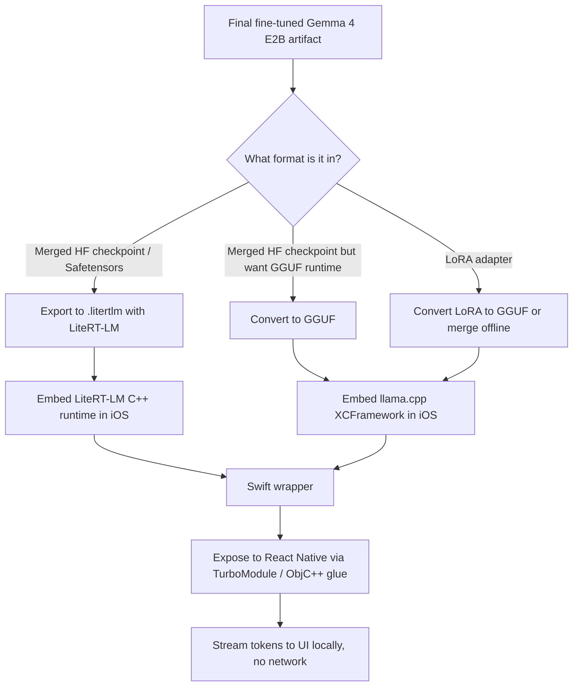

# Deploying a Fine-Tuned Gemma 4 E2B Model to iOS

## Executive summary

The highest-confidence answer is that there are **not yet many public, well-documented examples of individual developers showing a custom fine-tuned Gemma 4 E2B model running in a real iOS app**, but there **is now an official deployment path** from Google for exactly that outcome. Google’s current Gemma 4 LiteRT-LM documentation says you can start from **your custom Safetensors checkpoint after fine-tuning**, export it to `.litertlm`, and deploy it on iOS; Google also publishes Gemma 4 E2B iOS benchmark data and states that LiteRT-LM supports iOS and Gemma 4 E2B/E4B today. That makes **LiteRT-LM the strongest official route** if your final artifact is a merged Hugging Face-style checkpoint in Safetensors format. citeturn32view0turn31view1turn41view3

If your final artifact is instead a **LoRA adapter** or you want a runtime with a mature iOS embedding story today, **llama.cpp is the strongest community route**. The upstream project ships an XCFramework path for Apple platforms, includes an official SwiftUI iPhone example, requires GGUF as the runtime format, and supports converting PEFT LoRA adapters to GGUF plus loading LoRA adapters at runtime. A public iPhone demo by `sevenuphome` shows Gemma 4 E2B running fully offline on iPhone with Metal acceleration and explicit RAM gating. citeturn8view1turn10view0turn23view0turn23view1turn22search1turn41view1

So the practical recommendation is simple: if you have a **merged fine-tuned Gemma 4 E2B checkpoint**, use **LiteRT-LM**. If you have a **GGUF-targeted workflow, a LoRA adapter, or you want the most battle-tested iOS embedding path in native/React Native**, use **llama.cpp + GGUF**. I would **not** start a new iOS deployment today on MediaPipe LLM Inference, because Google now marks the Android and iOS implementations as deprecated and recommends migrating to LiteRT-LM. citeturn38search0turn38search2

## Public evidence that this is being done

The public record is strongest around **projects and maintainers**, not around many individual blog posts saying “here is my custom fine-tuned Gemma 4 E2B iOS app.” The table below separates what is **proven publicly** from what is still mostly implied.

| Project or publisher | What exists publicly | Does it prove iOS deployment? | Does it prove fine-tuned deployment? | What it means for you |
|---|---|---|---|---|
| **Google AI Edge / LiteRT-LM team** | Official Gemma 4 docs say LiteRT-LM supports Gemma 4 E2B and E4B, supports iOS, publishes Gemma 4 E2B iOS performance numbers, and gives a “Deploy from Safetensors” flow explicitly for **custom safetensors after fine-tuning**. citeturn32view0turn31view1turn41view3 | **Yes**. Official iOS support and iOS benchmark numbers are published. citeturn32view0turn31view1 | **Yes, officially supported** as a workflow, even if the docs don’t showcase a named third-party app. citeturn32view0 | This is the best-supported path for a merged fine-tuned checkpoint. |
| **`litert-community/gemma-4-E2B-it-litert-lm`** | A deployment-ready LiteRT-LM Gemma 4 E2B artifact exists on Hugging Face, and LiteRT-LM is positioned by Google as production-ready across iOS, Android, desktop, web, and IoT. citeturn41view0turn31view1turn41view3 | **Yes**, as a deployment artifact and runtime ecosystem. citeturn31view1turn41view3 | **Not by itself**; this specific artifact is a runtime-ready model, not proof of a custom private fine-tune. citeturn41view0 | Good reference artifact for validating the runtime before swapping in your own final checkpoint. |
| **`sevenuphome/gemma4-iphone-demo`** | A public SwiftUI iPhone app runs Gemma 4 E2B entirely on-device using llama.cpp, Metal acceleration, resumable model download, storage budgeting, and RAM checks. It targets iPhone 13 Pro or newer and iOS 17+. citeturn41view1 | **Yes**, very directly. citeturn41view1 | **No**, it demonstrates the base/quantized model rather than a custom fine-tune. citeturn41view1 | Strong proof that the iPhone runtime side is viable; you can swap in your own GGUF if your fine-tune is merged or converted. |
| **ggml-org / llama.cpp maintainers** | Upstream llama.cpp requires GGUF, provides conversion scripts, ships an Apple XCFramework route, includes an official SwiftUI iPhone example, and supports GGUF LoRA adapters via conversion plus runtime loading. citeturn8view1turn8view3turn10view0turn23view1turn22search1 | **Yes**, for the runtime stack. citeturn8view1turn10view0 | **Yes**, in the sense that LoRA and merged-model deployment are supported by the toolchain. citeturn22search1turn23view1 | Best community path for iOS-native or React Native embedding when your deployable artifact is GGUF. |

One useful signal of how recent this capability is: on **April 13, 2026**, a user opened a LiteRT issue asking almost exactly your question — how to convert a fine-tuned Gemma 4 Safetensors model to LiteRT-LM for iOS. Google’s current Gemma 4 LiteRT-LM docs, updated **May 5, 2026**, now document the “Deploy from Safetensors” path for custom models. That suggests the official answer became materially clearer only very recently. citeturn41view2turn32view0

## The deployment paths that actually fit iOS

### LiteRT-LM for a merged final checkpoint

If your final deliverable is a **merged Hugging Face-format model checkpoint** in Safetensors format, this is the cleanest route. Google’s LiteRT-LM docs say Gemma 4 E2B and E4B are supported today, the runtime is cross-platform including iOS, and the Gemma 4 page explicitly says to deploy from your **custom safetensors after fine-tuning** by exporting to `.litertlm`. Google also publishes E2B iOS numbers showing GPU decode materially faster than CPU decode on a reference iPhone. citeturn32view0turn31view1turn41view3

The strongest reasons to choose LiteRT-LM are that it is **officially documented by Google for Gemma 4**, it is intended for on-device deployments across iOS and other edge targets, it supports hardware acceleration, and Google’s own AI Edge Gallery app and source code provide a reference for on-device Gemma experiences. citeturn31view1turn41view3

A minimal export flow, staying close to Google’s published command pattern, looks like this:

```bash
uv tool install litert-torch-nightly

litert-torch export_hf \
  --model=/path/to/your/fine_tuned_hf_checkpoint \
  --output_dir=build/gemma4e2b_ios \
  --externalize_embedder \
  --jinja_chat_template_override=litert-community/gemma-4-E2B-it-litert-lm
```

That command shape is directly aligned with Google’s Gemma 4 LiteRT-LM deployment docs; replace the model argument with your final Hugging Face-format fine-tuned checkpoint. citeturn32view0

For iOS specifically, the main caveat is that the **LiteRT iOS pods** documented in the public iOS quickstart are the lower-level LiteRT runtime pods, while LiteRT-LM itself is exposed primarily as a cross-platform C++ framework in the current public materials. In practice, that points toward embedding LiteRT-LM on iOS as a native C++ layer and then wrapping it for Swift or React Native. citeturn39view0turn33search7turn41view3

### llama.cpp for GGUF or LoRA-based deployment

If your final model is already merged and you want maximum flexibility in mobile embedding, or if your fine-tune is still a **PEFT/LoRA adapter**, the most practical route is GGUF with llama.cpp. Upstream llama.cpp says models must be in **GGUF**, and the project includes conversion scripts for Hugging Face models and for LoRA adapters. The server and CLI accept `--lora`, and the ecosystem includes a SwiftUI example plus an XCFramework path for iOS. citeturn8view1turn8view3turn10view0turn23view1turn22search1

A merged-checkpoint path looks like this:

```bash
git clone https://github.com/ggml-org/llama.cpp.git
cd llama.cpp
cmake -B build
cmake --build build -j --target llama-quantize

python convert_hf_to_gguf.py /path/to/your/fine_tuned_hf_checkpoint \
  --outfile build/gemma4e2b-finetuned-bf16.gguf \
  --outtype bf16

./build/bin/llama-quantize \
  build/gemma4e2b-finetuned-bf16.gguf \
  build/gemma4e2b-finetuned-Q4_K_M.gguf \
  Q4_K_M
```

And if your final artifact is a LoRA adapter rather than merged weights, the relevant route is:

```bash
python convert_lora_to_gguf.py /path/to/your_lora_adapter \
  --base /path/to/base_model \
  --outfile build/gemma4e2b-finetuned-lora.gguf
```

The official llama.cpp materials support both the existence of `convert_lora_to_gguf.py` and runtime loading of LoRA adapters. citeturn22search2turn23view1turn23view0

For iOS, llama.cpp’s Apple story is unusually good for an open-source runtime. The upstream README exposes a precompiled XCFramework path, and the official `llama.swiftui` example says it is a sample app for local inference of llama.cpp on an iPhone, built by first generating the XCFramework with `./build-xcframework.sh`. citeturn8view1turn10view0

This is also the route with the clearest “real iPhone” public example today: the `sevenuphome` demo runs Gemma 4 E2B offline on iPhone with Metal acceleration, uses a ~2.45 GB Q3_K_S GGUF, requires ~5 GB free storage, and gates load on devices below the 6 GB RAM class. citeturn41view1

### Why I would not start with MediaPipe LLM Inference

Google’s older Gemma mobile docs and conversion docs still describe `.task` bundles and MediaPipe LLM Inference for Android and iOS, and they explicitly state that this path can start from a fine-tuned Safetensors model. But Google’s current iOS and general LLM Inference pages now mark the Android and iOS implementations as **deprecated** and recommend migration to LiteRT-LM. Also, the older `.task` conversion route is documented as **CPU-only** for LiteRT Torch Generative API at that stage. citeturn37view0turn38search0turn38search2

So while MediaPipe proves that Google has supported fine-tuned Gemma mobile deployment conceptually for some time, I would treat it as a legacy bridge, not the path to adopt for a new iOS integration. citeturn37view0turn38search0turn38search2

## Recommended path for your case

Given your clarification that you **do not need the fine-tuning pipeline** and only care about getting the **final model onto iOS**, I would decide purely based on the form of your final artifact:



If your final model is a **merged checkpoint**, I recommend **LiteRT-LM first** because Google explicitly documents custom-Safetensors deployment for Gemma 4, positions LiteRT-LM as production-ready on iOS, and publishes Gemma 4 E2B iOS performance and support statements. citeturn32view0turn31view1turn41view3

If your final model is a **LoRA adapter** or you need the easiest native embedding path right now, I recommend **llama.cpp**. Its GGUF format is purpose-built for local inference, the runtime supports LoRA, the Apple packaging story is mature, and there is already a public Gemma 4 E2B iPhone demo you can copy structurally. citeturn15view0turn10view0turn23view1turn41view1

For a **React Native app on iOS**, the clean integration model is to keep generation in native code and expose it through a **TurboModule with Objective-C++ glue**, because React Native’s current docs explicitly steer iOS native modules toward Objective-C++ for interoperability with C++ and recommend the New Architecture/TurboModules; Hermes is the default JS engine and the pure-C++/TurboModule path is the preferred way to share native logic across platforms. In other words, do not stream one token at a time over the old bridge if you can avoid it. citeturn25view0turn25view1turn25view2turn25view3turn25view4

A minimal React Native-facing interface can be as small as this:

```ts
// NativeGemma.ts
import type {TurboModule} from 'react-native';
import {TurboModuleRegistry} from 'react-native';

export interface InitOptions {
  modelPath: string;
  contextLength?: number;
  temperature?: number;
  topP?: number;
  maxOutputTokens?: number;
}

export interface Spec extends TurboModule {
  initialize(options: InitOptions): Promise<boolean>;
  startGeneration(prompt: string, requestId: string): void;
  cancel(requestId: string): void;
}

export default TurboModuleRegistry.getEnforcing<Spec>('NativeGemma');
```

And the native side should keep the runtime alive as a long-lived engine object, then emit partial tokens or chunked text back to JS via events rather than synchronous bridge calls for every decode step. That architecture aligns with React Native’s current native-module guidance and with how long-running native workloads should be isolated from UI work. citeturn25view0turn25view1turn25view2

## Practical notes that matter on real iPhones

Even though your question is about deployment rather than training, two operational facts matter immediately.

First, **Gemma 4 E2B is realistic only on the higher-memory iPhone classes**. Apple does not publish RAM in its tech specs, but public device databases show iPhone 12 and iPhone 13 at 4 GB RAM, while later Pro-class and newer AI-capable devices rise into the 6–8 GB range; the public Gemma 4 iPhone demo explicitly refuses to load on devices below the 6 GB class and targets iPhone 13 Pro or newer. Apple’s own docs also emphasize that iOS memory limits vary by device model and that apps can be terminated under jetsam pressure, so this is something you must validate on each supported device tier. citeturn27search0turn27search1turn27news44turn41view1turn26search0turn26search2turn26search16

Second, **storage planning is part of deployment design**. The official GGUF repo for Gemma 4 E2B shows roughly **4.97 GB** for `Q8_0`, **9.31 GB** for `bf16`, and separate multimodal projector files of **557 MB** or **987 MB**. The sevenuphome demo instead uses a **~2.45 GB Q3_K_S** quantized model and asks for ~5 GB free storage headroom. If your app is text-only, the practical implication is to avoid shipping multimodal projector assets and to use a mobile-friendly quantization tier. citeturn34view0turn41view1

If you go through the App Store, Apple’s build rules also matter: iOS app bundles must stay under the maximum uncompressed build size, and Apple recommends app thinning and on-demand resources where appropriate. If you plan to deliver the model post-install rather than bundle it, that aligns well with how the public iPhone demo handles first-launch download and cache. citeturn19search11turn19search10turn19search0turn41view1

## Open questions and limitations

The biggest limitation in the current public record is that I did **not** find a large set of public repos from named individuals explicitly saying, “here is my own custom fine-tuned Gemma 4 E2B running in production on iOS.” What I found instead is a much stronger and more useful combination: **official Google support for exporting custom fine-tuned Gemma 4 Safetensors to LiteRT-LM for iOS**, plus **real community proof that Gemma 4 E2B runs locally on iPhone via llama.cpp**. That is enough to choose a deployment path confidently, but it is not the same thing as a long list of public postmortems from other teams. citeturn32view0turn31view1turn41view1

The final choice therefore depends almost entirely on **what your final artifact looks like**. If you already have a merged Hugging Face-format checkpoint, start with LiteRT-LM. If you have a LoRA adapter or want a simpler Apple-native embedding path now, use llama.cpp and GGUF. Both paths are grounded in current primary-source evidence; LiteRT-LM is the more official answer, and llama.cpp is the more battle-tested community answer for embedding in an iOS app today. citeturn32view0turn41view3turn10view0turn23view1